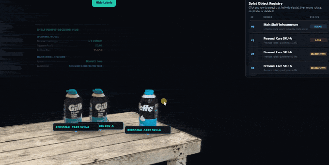
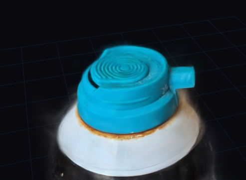
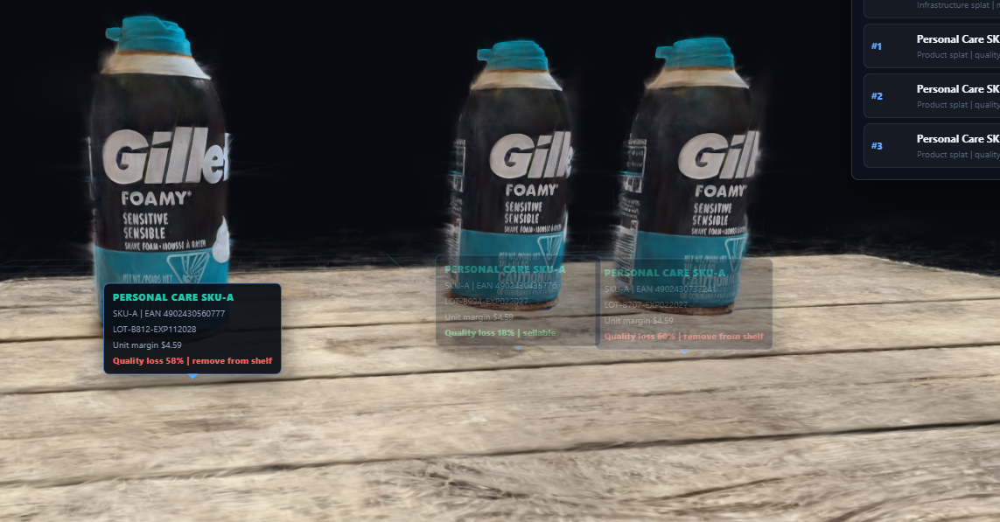
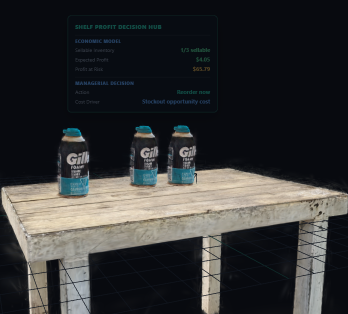

# Gaussian Splat Digital Twin Viewer

A web-based Gaussian Splat viewer for an interactive digital twin scene with spatial data and labels.

<p align="center">
  
</p>

---

## 🧠 Setup

### Requirements
- Python 3.13 or later installed

### Run locally

1. Open a terminal / Command Prompt
2. Navigate to the project folder:

```bash
cd gaussian-splat-scene
```
Start a local server:
```python -m http.server 8000```

Open in your browser:
```http://localhost:8000/index.html```


Works on Chrome, Edge, and Firefox.

---

## 🚀 Features

- Web-based Gaussian Splat rendering (Three.js-style pipeline)
- Multiple splat objects (table, product)
- UI labels anchored in 3D space
- Interactive product/info panels
- Real-time product inspection
- Toggleable floating labels
- Ability to duplicate products (Shift + D)

---

## 🧠 Concept

This project explores digital twins for physical environments where:

- Objects are reconstructed using Gaussian splatting
- Each object carries attached metadata
- UI elements are positioned in 3D space

---

## 🖼️ Example Scenes

### Detail View (Rusty Can Close-up)
A close inspection of a scanned can showing surface rust and material defects.

<p align="center">
  
</p>
- Use case: material inspection / quality analysis

### Product Info View (Tagged Can)
A can with an attached spatial product label containing metadata.

<p align="center">
  
</p>
- Use case: retail labeling, SKU association, product intelligence

### Table Overview (Environment Context)
A wider scene showing a table with spatial tags floating above objects.

<p align="center">
  
</p>
- Use case: warehouse / retail shelf-level digital twin

---

## 🎮 Controls

- Sidebar (right): splat registry + object management
- Left panel: metrics / metadata display
- Top button: toggle floating labels
- Click objects: select splat
- Click splat registry: select splat

---

## ⚙️ How It Works

1. Load Gaussian splat scenes into the browser
2. Attach metadata (SKU, condition, stats, etc.)
3. Bind UI elements to 3D world positions
4. Render labels using CSS2D overlays

---

## 📦 Splat Formats

Recommended formats:

- `.splat` → fast, lightweight web format
- `.ply` → raw source format (heavier, slower)

Convert using:
- https://superspl.at/editor
- https://github.com/mkkellogg/GaussianSplats3D

---

## 💡 Use Cases

- Retail digital twins
- Inventory visualization
- Product inspection systems
- Warehouse / shelf analytics
- 3D operational dashboards

---

## 🧪 Future Ideas

- Live database sync per object
- AI-based product tagging
- Multi-scene merging
- Occlusion-aware labeling
- Streaming large splat datasets
